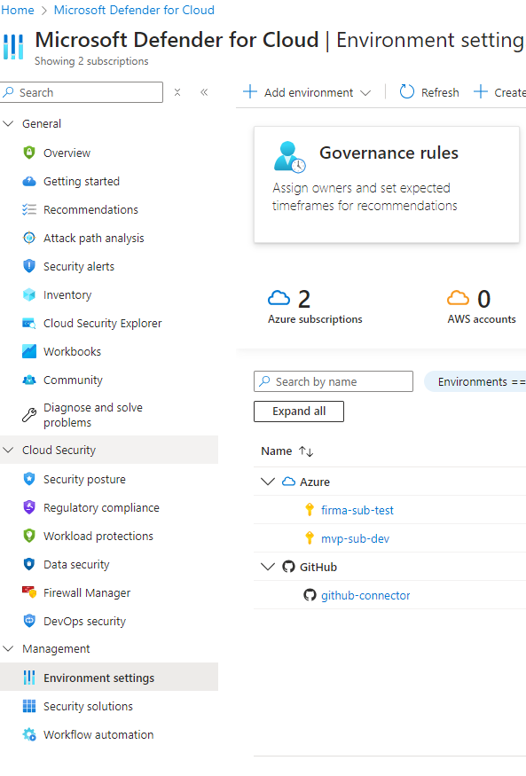
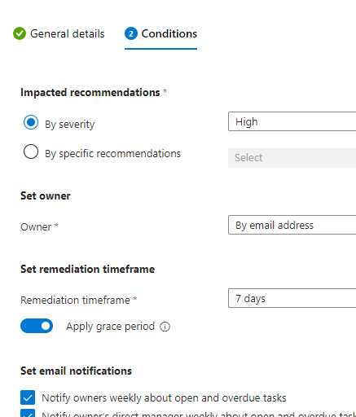

# Microsoft Defender for Cloud Regulatory Compliance

The regulatory compliance feature in Defender for Cloud provides important guidance on how secure your cloud environment is and how to create governance rules to enforce compliance.

---

## Introduction

Azure has a feature in Microsoft Defender for Cloud called regulatory compliance that allows you to start getting your cloud compliance under control. Central to this feature is the [Microsoft Cloud Security Benchmark](https://learn.microsoft.com/en-us/security/benchmark/azure/).

---

## What is the Microsoft Cloud Security Benchmark?

The MCSB for short, is a set of practices that form a track of the [Cloud adoption framework for Azure](https://learn.microsoft.com/en-us/azure/cloud-adoption-framework/) from Microsoft.

This has been traditionally a set of best practices and guidelines for cloud deployments but more recently it has been integrated into the Defender for Cloud portal to provide that bridge from the adoption framework to reporting on resources against best practices.

---

## Defender for Cloud regulatory compliance

The portal provides an overview of all of the MCSB controls and the number of controls that have either passed or not. The controls cover not only Azure but also both Amazon Web Services & Google Cloud Platform as well as GitHub and Azure DevOps that are integrated into DevOps Security.

Diving into the compliance controls will reveal what resources are non-compliant, for example, the compliance control for privileged access reveals that there is a requirement for multiple owners on 1 subscription.

Clicking on the control details link will provide some additional info associated with the control with the relevant compliance status in your subscription and links the MCSB control in Microsoft docs for further information.

---

## Remediation

Getting to work remediating the fixes involves opening the affected non-compliant resource and following the remediation steps outlined in the resource compliance status.

---

## Governance rules

It’s also possible to enforce remediation via governance rules to assign owners and due dates for addressing recommendations on specific resources.

This is particularly useful for large Azure environments with multiple subscriptions where it is unmanageable for the security team to implement fixes. These fixes will give accountability to the resource owners and issue an SLA for remediation.

Governance rules are created in the environment settings of the Defender for Cloud portal.

The governance rules pane allows you to create governance rules based on subscription scope.

Then you can add conditions to alert based on severity or based on specific recommendations in the MCSB controls. Setting owners and remediation timeframes enforces governance with tailored timeframes and email notifications.

---

## Summary

In summary, Microsoft Defender for Cloud’s regulatory compliance feature helps ensure the security and compliance with the Microsoft Cloud Security Benchmark (MCSB) integrated into the Defender for Cloud portal.

These controls bring to life tracking and reporting on resources’ compliance status and setting of compliance controls, showing which have passed or failed. Detailed information about non-compliant resources is accessible, including remediation steps.

Finally, governance rules can be enforced to assign responsibility and set deadlines for addressing compliance issues which brings the whole security compliance lifecycle management together.

---
